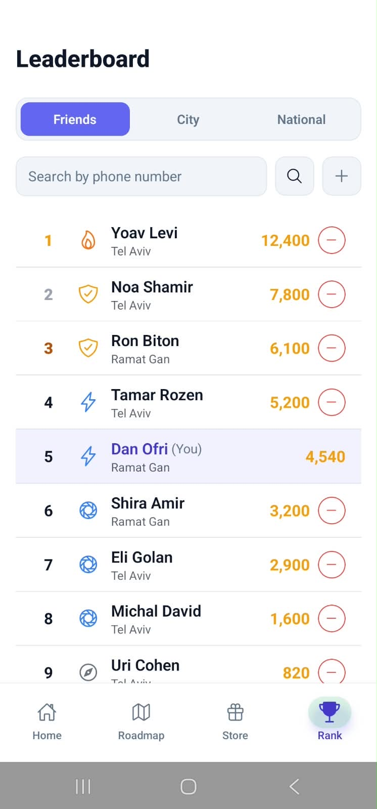
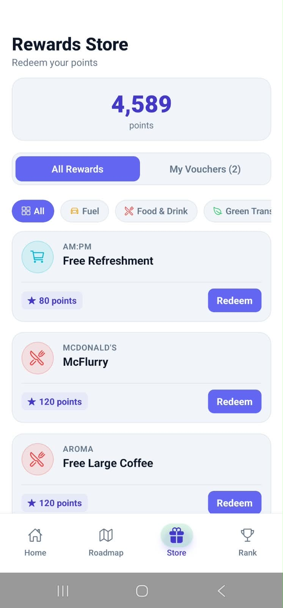
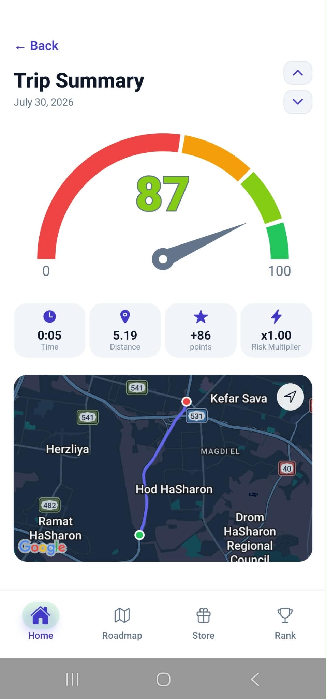
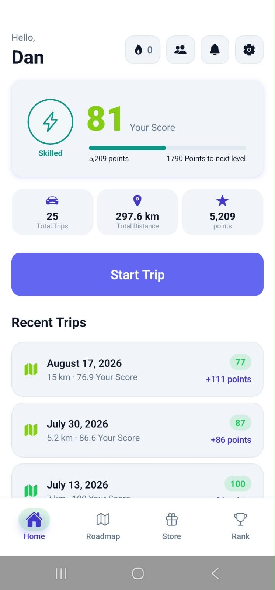
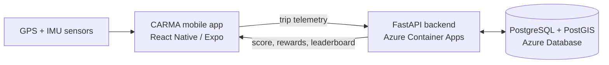

  <picture>
    <source media="(prefers-color-scheme: dark)" srcset="docs/brand/Logos/PNG/CARMA%20White.png">
    
  </picture>

  
  
  
  
  
  

CARMA is a mobile platform for young drivers in Israel that rates driving behavior in real time. Drivers earn a CARMA Score from GPS and IMU sensor data, and turn safe driving into points they can redeem with partner businesses.

  
  
  
  

The app in action

---

## Contents

- [Key Features](#key-features)
- [Architecture](#architecture)
- [Repository Map](#repository-map)
- [Further Reading](#further-reading)
- [Team](#team)

---

## Key Features

- **Real-time CARMA Score.** Computed server-side from GPS and IMU telemetry, weighted across five components and checked against published telematics baselines (CMT, US crash-rate data). See [docs/scoring.md](docs/scoring.md).
- **Transport-mode detection.** A sliding-window classifier scores speed, lateral acceleration, and yaw rate to tell private-car driving apart from walking, cycling, or riding as a passenger, before a trip is ever scored.
- **Gamification and rewards.** CARMA points convert into levels and QR-coded vouchers redeemable at partner businesses, with a live leaderboard.
- **Hebrew and English, RTL by default.** The app ships right-to-left for Israeli drivers, with a language switch that flips direction live. See [docs/i18n.md](docs/i18n.md).

---

## Architecture

CARMA runs entirely in the cloud. The mobile app is the only piece that lives on a personal device. The backend and the database do not.

- The app (React Native / Expo) collects GPS and IMU telemetry during a trip and uploads it once the trip ends.
- A FastAPI backend on Azure Container Apps is the only place a trip is ever scored. The formula never runs on the phone, so nobody can inflate their own score by patching the app.
- PostgreSQL (Azure Database for PostgreSQL, with PostGIS for trip geometry) stores everything: trips, scores, the leaderboard, the rewards marketplace.

---

## Repository Map

### Engineering

| Folder | What it is | Technology |
|---|---|---|
| `server/` | Backend: API, DB, business logic | Python / FastAPI / PostgreSQL |
| `mobile/` | Mobile app | React Native / Expo |
| `web/` | Business-facing web app | React / Vite / TypeScript |
| `docs/` | How the system works today | Markdown |
| `scripts/` | `setup.ps1`, `dev.ps1`, `dev-tunnel.ps1`, `smoke.sh` | PowerShell |
| `.github/` | CI and deployment workflows | GitHub Actions |
| `.claude/` | Rules for AI assistants working in this repo | Markdown |
| `screenshots/` | App screenshots used in docs and decks | JPG / PNG |

### Root documents

| File | What it holds |
|---|---|
| `SYSTEM.md` / `SYSTEM.he.md` | Full system reference: schema, API, deployment. English and Hebrew. |
| `CHANGELOG.md` | Every change to the HTTP contract and shared behaviour. |
| `CLAUDE.md` | The team's engineering contract: branches, CI gates, definition of done, Linear issue tracking. Also the working contract for AI coding assistants. |

### Product & non-engineering

| Folder | What it holds |
|---|---|
| `Hub/` | Entrepreneurship-workshop material: pitch deck, business model canvas, product requirements. No code depends on it. |

---

## Further Reading

The technical depth lives here, not in this file.

| Document | What it answers |
|---|---|
| [SYSTEM.md](SYSTEM.md) | The full reference: schema, every endpoint, auth flows, CI/CD, Azure. |
| [docs/scoring.md](docs/scoring.md) | How the CARMA Score is actually computed. |
| [docs/fraud-detection.md](docs/fraud-detection.md) | The anti-fraud architecture we build toward: threat model, gates, contracts. |
| [docs/RFC-001-Hybrid-Validation.md](docs/RFC-001-Hybrid-Validation.md) | *History, not current behaviour.* Why trip validation was split between client and server in May 2026. Parts are superseded. The banner says which. |
| [docs/i18n.md](docs/i18n.md) | Hebrew / English handling. |
| [docs/development.md](docs/development.md) | Running the stack on your own machine, for anyone changing `server/` or `mobile/` code. |
| [mobile/STRUCTURE.md](mobile/STRUCTURE.md) | What belongs in every folder under `mobile/src/`. Read before adding a file. |
| [CHANGELOG.md](CHANGELOG.md) | What changed in the API contract, and when. |

---

## Team

| Role | Owner |
|---|---|
| CPO: scoring formula, roadmap, anti-fraud mechanics, app security | Dan |
| CTO: database, infrastructure, CI/CD, monorepo integrity | Naveh |
| CEO: business-logic API endpoints, third-party integrations | Shaun |
| Mobile & Frontend Lead: screens, UI, driving SDK | May |
