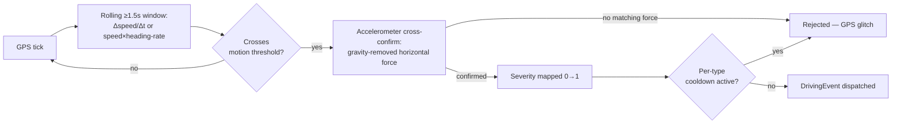
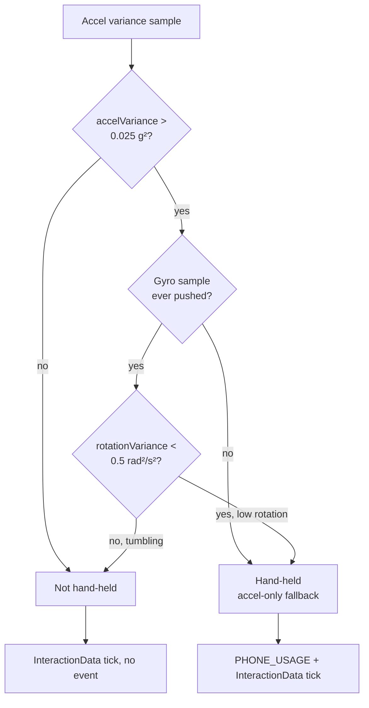

Current behaviour.

# Event detection

Part of [`driving-sdk`](../README.md) — how motion events and hand-held
detection are actually computed. The README's Sensor Event API section
covers the consumer-facing `on()`/`off()` surface; this file is the
mechanism behind it.

---

## Motion-event detection (brake / accel / turn) — `SensorManager`

Detects `HARD_BRAKE` / `AGGRESSIVE_ACCEL` / `SHARP_TURN` via **GPS+IMU
fusion**, independent of how the phone is oriented in the vehicle (vent
mount, cup holder, pocket — all work the same):

- **Trigger + direction (GPS, orientation-free):**
  - Longitudinal accel = `Δspeed / Δt` → brake (deceleration) / accel.
  - Lateral accel = `speed × heading-rate` → sharp turn.
  - Evaluated over a rolling ≥1.5 s window so a burst of high-frequency GPS ticks doesn't read as a phantom spike.
  - Turn detection is skipped below ~10 km/h, where GPS heading is unreliable.
- **Severity + cross-confirm (accelerometer, orientation-free):**
  - Gravity is removed (EMA low-pass filter, α = 0.9), and the *horizontal* magnitude of what remains is computed — this magnitude doesn't depend on the phone's yaw, so it's meaningful regardless of mounting angle.
  - A GPS-detected event only fires if the accelerometer also registered a matching horizontal force (rejects pure GPS glitches); the IMU peak also refines the reported severity.
- Thresholds default to `DEFAULT_MOTION_THRESHOLDS` (2.7 / 3.0 / 3.5 m/s² — aligned with common UBI/telematics "harsh event" bands) — override via `SDKConfig.motionThresholds`.
- Severity mapping: `threshold → 0.0`, `threshold + 5.0 m/s² → 1.0`, clamped to `[0, 1]`.

---

## GPS — `SensorManager`

- Update interval: **2 s** / **5 m** (whichever comes first, `Accuracy.High` — GPS chip only, no network/cell fallback)
- Distance: Haversine formula between consecutive samples
- Speed: from `loc.coords.speed` (m/s → km/h). expo reports **`-1`**, not `0`, when speed is momentarily unavailable (weak fix, urban canyon, parking garage) — clamping that to `0` would read as a real deceleration to a standstill, so the last known-good reading is carried forward instead. It decays back to `0` only after **10 s** without a valid reading, so a sustained dropout can't pin the reported speed above a consumer's "stopped" threshold indefinitely.
- Duplicate-tick guard: a fix arriving less than 500ms after the previous one is dropped before it reaches distance/motion math — some devices emit near-duplicate GPS fixes in bursts (#17), which would otherwise imply physically impossible accelerations.
- Background tracking: a TaskManager task keeps GPS updates flowing while the app is backgrounded or the phone is locked.

### Waypoint cadence — `Accuracy.BestForNavigation` tried and reverted — #17

Live cloud data found waypoint cadence degrading badly on some devices — a
~6 s median gap instead of the requested 2 s, with individual gaps over 15 s —
which coarsens the route trace and any speed or distance figure derived from
it. **Root cause:** some Android OEMs (Xiaomi, Huawei, Samsung, …) throttle
background location under Doze, battery-saver, or their own power management,
regardless of the requested accuracy tier.

Raising accuracy from `High` to `BestForNavigation` looked like the direct
lever, but on Android it isn't one: expo-location's `mapAccuracyToPriority`
maps both `High` and `BestForNavigation` to the same `PRIORITY_HIGH_ACCURACY`,
and the caller-supplied `timeInterval`/`distanceInterval` override the
accuracy-derived request params regardless — so the resulting `LocationRequest`
is identical either way. On iOS, `BestForNavigation` *is* a distinct,
higher-power tier, so raising it there would cost real battery for zero
cadence benefit on Android.

Staying on `Accuracy.High`. The duplicate-tick guard above is fully
implemented, but no accuracy setting alone fixes the underlying throttling —
the only real lever is the user exempting the app from battery optimization,
which is what `PowerManagement` exists to support. **#17 remains open**; that
nudge is a mitigation, not a fix.

---

## Distance accumulation — `DrivingSDK`

`SensorManager` reports the raw per-tick Haversine distance; `DrivingSDK`
decides how much of it counts. Both guards below live in the orchestrator,
not the sensor layer.

- Distance gate: ticks below **3 km/h** do not accumulate distance (eliminates coordinate jitter when stationary).
- Teleportation guard: each tick's distance contribution is capped to `(speed / 3600) × timeDeltaS × 1.5 km`. If the Haversine result exceeds this cap (e.g. a GPS position jump while stationary), the capped value is used instead.
- **Waypoints, `(since #139)`:** appended on the same gate, downsampled to one
  point per **~5 seconds of real elapsed GPS time** while moving —
  accumulated from each tick's actual measured interval (`timeDeltaS`, floored
  at 0.5 s), not an assumed fixed cadence. Before #139 this accumulator
  hardcoded `+= 2` regardless of the real interval, so a throttled or jittery
  GPS stream (see #17 above) silently desynced waypoint density from
  wall-clock reality. The ~5s-elapsed target itself is unchanged — only the
  accounting behind it is real now. At a steady 2 s tick interval the nominal
  rate is unchanged too (~300 points per 30 minutes); the fix only matters
  when ticks *aren't* steady.

---

## Gyroscope — `SensorManager`

Raw yaw rate is captured at 10 Hz and exposed as `accelX`/`gyroZ` telemetry
on every `onUpdate` tick, for use by an app-supplied `TripValidator` (e.g.
transport-mode fraud detection). It does not itself trigger any
`DrivingEventType`. The same 10 Hz gyroscope stream is also shared with
`PhoneUsageManager` (see below) rather than opening a second subscription.

---

## Hand-held detection — `PhoneUsageManager`

Answers one question: **is the phone in a hand, or fixed to the vehicle?**
Touches delivered to other apps are not observable — see
[`PLATFORM-CAPABILITIES.md`](../PLATFORM-CAPABILITIES.md) — so device motion
is used as a proxy. One delta is emitted per second via `onInteractionData`
(see [trip-lifecycle.md](./trip-lifecycle.md) for the accounting), plus the
`PHONE_USAGE` event.

- **Variance window:** accelerometer magnitude over a rolling **10 samples at 10 Hz** (a 1-second window). Gyroscope samples, when the host pushes them in, share the same window.
- **Hand-held threshold:** variance above **0.025 g²**. A phone on a vehicle mount sits at ~0.002–0.010 g² (road vibration only); a hand-held phone at ~0.030–0.150 g² (micro hand-movements).
- **Rotation veto, `(since #138)`:** a phone loose on a seat also bounces
  enough to trip the acceleration threshold, but it tumbles — a hand keeps the
  phone's orientation stable, a loose phone doesn't. So a high-variance
  reading only counts as hand-held when rotation variance over the same
  window stays below **0.5 (rad/s)²**; at or above it, the acceleration spike
  is read as a tumbling phone rather than a hand. If the host never calls
  `pushGyroSample()`, the veto is skipped and the decision falls back to
  acceleration alone — the behavior every version before #138 has.
- **Glass-tap proxy:** a single sample above **1.8 g** total magnitude flags a touch-epoch transient, with a **1 500 ms** cooldown so one physical tap isn't counted several times across the 10 Hz stream. This fires regardless of foreground/background.
- **`PHONE_USAGE`** fires once per hand-held stretch, not once per second — it re-arms as soon as a single tick falls below the combined threshold, so one pickup can produce more than one event.

> **These constants are IMU calibration values, not tuned parameters.** They
> were chosen from expected separation margins and **have never been
> validated against real drive data** — the rotation threshold most of all,
> since no drive-test data backs it yet (tracked as CAR-183). The glass-tap
> proxy also cannot distinguish a finger tap from a sharp road bump. Treat
> all of these as indicative until calibrated.

---

## Power management — `PowerManagement`

`isBackgroundThrottlingRiskPlatform()` and `openAppSystemSettings()` are the
only two exports: a platform check and a thin `Linking.openSettings()`
wrapper. This module has no UI and no opinion on when/whether to ask the
user — it exists so any consuming app can build its own nudge for the
Android OEM-throttling risk above (#17) without duplicating the platform
check.

---

## Per-event cooldown

After an event of a given type fires, the same type is suppressed for
**500 ms**. Each type has an independent cooldown window — a `SHARP_TURN`
does not suppress a concurrent `HARD_BRAKE`.

## Warm-up guard

The first **3 seconds** after `startTrip()` all sensor events are dropped.
This eliminates spurious spikes caused by the physical act of pressing the
start button.
