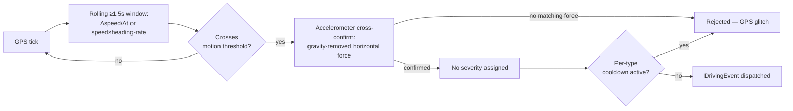
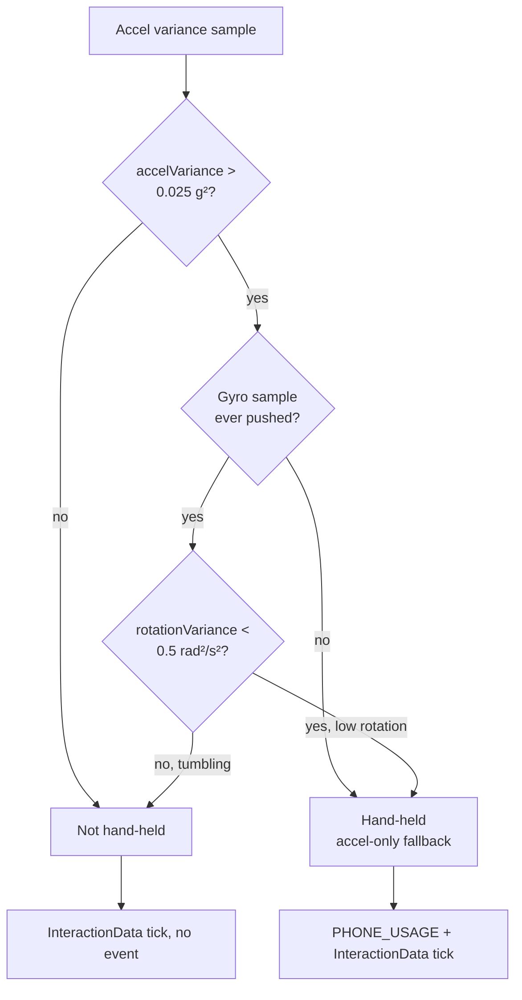

Current behaviour.

# Event detection

Part of [`driving-sdk`](../README.md) — how motion events and hand-held
detection are actually computed. The README's Sensor Event API section
covers the consumer-facing `on()`/`off()` surface; this file is the
mechanism behind it.

---

## Motion-event detection (brake / accel / turn) — `SensorManager`

Detects `HARD_BRAKE` / `AGGRESSIVE_ACCEL` / `SHARP_TURN` via **GPS+IMU
fusion**, independent of how the phone is oriented in the vehicle (vent
mount, cup holder, pocket — all work the same):

- **Trigger + direction (GPS, orientation-free):**
  - Longitudinal accel = `Δspeed / Δt` → brake (deceleration) / accel.
  - Lateral accel = `speed × heading-rate` → sharp turn.
  - Evaluated over a rolling ≥1.5 s window so a burst of high-frequency GPS ticks doesn't read as a phantom spike.
  - Turn detection is skipped below ~10 km/h, where GPS heading is unreliable.
- **Cross-confirm (accelerometer, orientation-free):**
  - Gravity is removed (EMA low-pass filter, α = 0.9), and the *horizontal* magnitude of what remains is computed — this magnitude doesn't depend on the phone's yaw, so it's meaningful regardless of mounting angle.
  - A GPS-detected event only fires if the accelerometer also registered a matching horizontal force (rejects pure GPS glitches). This magnitude isn't a vehicle-frame axis, so it's used only as a gate — it is not reported as severity.
- Thresholds default to `DEFAULT_MOTION_THRESHOLDS` (2.7 / 3.0 / 3.5 m/s² — aligned with common UBI/telematics "harsh event" bands) — override via `SDKConfig.motionThresholds`.
- No severity is emitted on motion events until a phone→vehicle rotation stage resolves the IMU magnitude onto the axis `scoring.md` §3.4 needs (longitudinal for braking/accel, lateral for turns).

---

## GPS — `SensorManager`

- Requested at `Accuracy.High` (GPS chip only, no network/cell fallback), with a **2 s** time
  interval and a **5 m** distance filter. **What that means differs by platform:**
  - **Android** honours both, so a fix arrives on whichever comes first.
  - **iOS ignores the time interval entirely** — cadence is the distance filter alone, so a
    stationary device produces **no update at all**. This is why speed reaching zero is
    reported by a timer rather than by a fix; see *Speed decay* below.
  - The library also asks iOS for the `AutomotiveNavigation` activity type, which tunes the
    platform's own filtering for vehicle travel. Android ignores the option.
- Distance: Haversine formula between consecutive samples
- Speed: from `loc.coords.speed` (m/s → km/h). expo reports **`-1`**, not `0`, when speed is momentarily unavailable (weak fix, urban canyon, parking garage) — clamping that to `0` would read as a real deceleration to a standstill, so the last known-good reading is carried forward instead. It decays back to `0` only after **10 s** without a valid reading, so a sustained dropout can't pin the reported speed above a consumer's "stopped" threshold indefinitely.
- Duplicate-tick guard: a fix arriving less than 500 ms after the previous one is dropped before it reaches distance/motion math — some devices emit near-duplicate GPS fixes in bursts, which would otherwise imply physically impossible accelerations. A fix arriving with an *earlier* timestamp than the previous one is a clock step, not a duplicate, and is not dropped: the anchors are re-seeded against the new clock instead, because dropping it would make every later fix read as a duplicate until wall clock caught up.
- Background tracking: a TaskManager task keeps GPS updates flowing while the app is backgrounded or the phone is locked — **conditional on the background ("Always") location permission having been granted.** When it has not been, the library reports `backgroundLocationAvailable: false` on every update rather than failing silently, and location stops at the point the app leaves the foreground.

### Speed decay

Every 2 s, once the held speed has decayed to zero, `SensorManager` emits an update carrying
`currentSpeed: 0`, `distanceKm: 0` and **no position and no `fixTs`** — there is no new fix,
so there is no distance, no waypoint and no motion-event evaluation to do. Fabricating any of
those from a stale fix is exactly what this path exists to avoid.

Two consequences worth stating plainly. On iOS this tick is the **only** mechanism by which a
stop is ever observed. And it does not run while the app is backgrounded and suspended on
iOS; the decay is measured against wall clock, so it corrects itself the moment the app
resumes rather than replaying the ticks it missed.

### Waypoint cadence — `Accuracy.BestForNavigation` tried and reverted — #17

Live cloud data found waypoint cadence degrading badly on some devices — a
~6 s median gap instead of the requested 2 s, with individual gaps over 15 s — **measured on
Android; the figure is an Android one and does not describe iOS** —
which coarsens the route trace and any speed or distance figure derived from
it. **Root cause:** some Android OEMs (Xiaomi, Huawei, Samsung, …) throttle
background location under Doze, battery-saver, or their own power management,
regardless of the requested accuracy tier.

Raising accuracy from `High` to `BestForNavigation` looked like the direct
lever, but on Android it isn't one: expo-location's `mapAccuracyToPriority`
maps both `High` and `BestForNavigation` to the same `PRIORITY_HIGH_ACCURACY`,
and the caller-supplied `timeInterval`/`distanceInterval` override the
accuracy-derived request params regardless — so the resulting `LocationRequest`
is identical either way. On iOS, `BestForNavigation` *is* a distinct,
higher-power tier, so raising it there would cost real battery for zero
cadence benefit on Android.

Staying on `Accuracy.High`. The duplicate-tick guard above is fully
implemented, but no accuracy setting alone fixes the underlying throttling —
the only real lever is the user exempting the app from battery optimization,
which is what `PowerManagement` exists to support. The throttling remains unsolved; that
nudge is a mitigation, not a fix.

---

## Distance accumulation — `DrivingSDK`

`SensorManager` reports the raw per-tick Haversine distance; `DrivingSDK`
decides how much of it counts. Both guards below live in the orchestrator,
not the sensor layer.

- Distance gate: ticks below **3 km/h** do not accumulate distance (eliminates coordinate jitter when stationary).
- Teleportation guard: each tick's distance contribution is capped to `(speed / 3600) × timeDeltaS × 1.5 km`. If the Haversine result exceeds this cap (e.g. a GPS position jump while stationary), the capped value is used instead.
- **Waypoints:** appended on the same gate, downsampled to one point per
  **2 seconds of elapsed GPS-fix time** while moving. Two things decide that:
  - **The interval.** The server re-detects a brake as the average deceleration
    between two consecutive points, so a sampling interval longer than the event
    smears it across time in which nothing happened — at 5 s it takes a 54 km/h
    drop between two points to register a brake, where a real one is ~25 km/h.
    A hard brake lasts ~2 s, so the cadence is 2 s. ~900 points per 30-minute
    trip, and no extra battery: the location stream already runs at 2 s.
  - **The clock.** Elapsed time is measured between the GPS fixes themselves
    (`fixTs`), never between arrivals. Android defers updates under Doze and
    releases them as a batch in one JS turn (see the throttling note above), where arrival time
    barely moves — thinning against it would collapse the whole deferred window
    into a single point and stamp every point in the batch with one instant.

---

## Gyroscope — `SensorManager`

Yaw rate is captured at 10 Hz and resolved **about gravity** rather than about the device's
Z axis — the device's own Z axis is yaw only for a phone lying perfectly flat. It does not
itself trigger any `DrivingEventType`.

**Where these values arrive is not `onUpdate`.** The public `onUpdate` callback carries
`TripData`, which has no per-sample fields at all. The vehicle-frame values reach an
app-supplied `TripValidator` through `updateSample(ValidationSample)`, which is a different
shape and a narrower one:

| Value | Reaches a validator? |
|---|---|
| `longitudinalAccelG` | Yes, as `longitudinalAccelG` |
| `lateralAccelG` | Yes, as `lateralAccelG` |
| `yawRateRadS` | Yes, as `yawRate` |

All three arrive on every call, the speed-only decay tick included — there is one delivery
point, so a tick that carries no GPS fix still carries the vehicle-frame values.

Each of them is `null` rather than `0` when it cannot be resolved, and the two conditions are
not the same: the longitudinal/lateral split needs the vehicle's forward direction, which is
learned over the first real accelerations of a trip, while yaw about gravity needs only a
converged gravity estimate and a fresh gyroscope sample. Yaw can therefore be a number while
the forward direction is still unknown.

## Raw accel/gyro taps — `onAccelSample` / `onGyroSample`

Both the accelerometer and gyroscope subscriptions `SensorManager` already holds open are
also offered, raw, to other consumers, so that a second reader of the same sensor does not
have to power it twice: `PhoneUsageManager` and `RawSampleRecorder` (the latter only while a
staged calibration session is active — see the README's "Calibration recording" section).

**The sharing is not complete.** `PhoneUsageManager` takes the gyroscope through the tap and
opens **its own accelerometer subscription**, so an ordinary trip runs two listeners on the
one physical accelerometer. That costs battery and changes no reading.
Neither tap affects motion-event detection above; both fire unconditionally
at 10 Hz regardless of whether anything is currently listening.

The magnetometer is deliberately not a tap. `SensorManager` never subscribes
to it, because nothing here detects anything from it — so `RawSampleRecorder`
owns that subscription itself, opening it in `start()` and removing it in
`stop()`. A trip that runs without a staged session therefore holds no
magnetometer subscription at all.

---

## Hand-held detection — `PhoneUsageManager`

Answers one question: **is the phone in a hand, or fixed to the vehicle?**
Touches delivered to other apps are not observable — see
[`PLATFORM-CAPABILITIES.md`](../PLATFORM-CAPABILITIES.md) — so device motion
is used as a proxy. One delta is emitted per second via `onInteractionData`
(see [trip-lifecycle.md](./trip-lifecycle.md) for the accounting), plus the
`PHONE_USAGE` event.

- **Variance window:** accelerometer magnitude over a rolling **10 samples at 10 Hz** (a 1-second window). Gyroscope samples, when the host pushes them in, share the same window.
- **Hand-held threshold:** variance above **0.025 g²**. A phone on a vehicle mount sits at ~0.002–0.010 g² (road vibration only); a hand-held phone at ~0.030–0.150 g² (micro hand-movements).
- **Rotation veto:** a phone loose on a seat also bounces
  enough to trip the acceleration threshold, but it tumbles — a hand keeps the
  phone's orientation stable, a loose phone doesn't. So a high-variance
  reading only counts as hand-held when rotation variance over the same
  window stays below **0.5 (rad/s)²**; at or above it, the acceleration spike
  is read as a tumbling phone rather than a hand. If the host never calls
  `pushGyroSample()`, the veto is skipped and the decision falls back to
  acceleration alone.
- **Glass-tap proxy:** a single sample above **1.8 g** total magnitude flags a touch-epoch transient, with a **1 500 ms** cooldown so one physical tap isn't counted several times across the 10 Hz stream. This fires regardless of foreground/background.
- **Paired-peak tap signature:** reported as `gyroTapPairs` on the motion features, and
  independent of everything above — it changes no decision the manager makes. A jolt
  through the suspension drives mostly the vertical accelerometer axis; a finger on glass
  produces a small *rotational* kick on both in-plane axes at once, because the hand's
  grip resists it. A pair is both X and Y between **0.2 and 0.7 rad/s** on the same
  sample, counted on the sample that enters the band rather than on every sample inside
  it; a tap is two pairs within **400 ms**. The Z axis is excluded on purpose — in a flat
  mounting it is the vehicle's own yaw, and including it would let a turn qualify.
  The 10 Hz feed puts a floor of 100 ms under the repeat gap, so the tightest gaps the
  method describes cannot be resolved at this sample rate.
- **`PHONE_USAGE`** fires once per hand-held stretch, not once per second — it re-arms as soon as a single tick falls below the combined threshold, so one pickup can produce more than one event.

> **These constants are IMU calibration values, not tuned parameters.** They
> were chosen from expected separation margins and **have never been
> validated against real drive data** — the rotation threshold most of all,
> since no drive-test data backs it yet. The glass-tap
> proxy also cannot distinguish a finger tap from a sharp road bump. Treat
> all of these as indicative until calibrated. The tap-signature band and repeat gap are
> the patent's own worked example and carry the same caveat.

---

## Power management — `PowerManagement`

`isBackgroundThrottlingRiskPlatform()` and `openAppSystemSettings()` are the
only two exports: a platform check and a thin `Linking.openSettings()`
wrapper. This module has no UI and no opinion on when/whether to ask the
user — it exists so any consuming app can build its own nudge for the
Android OEM-throttling risk above without duplicating the platform
check.

---

## Per-event cooldown

After an event of a given type fires, the same type is suppressed for
**500 ms** — **except `PHONE_USAGE`, which is exempt from the cooldown
entirely** and is re-armed by its own hand-held stretch instead. Each type
has an independent cooldown window — a `SHARP_TURN`
does not suppress a concurrent `HARD_BRAKE`.

## Warm-up guard

The first **3 seconds** after `startTrip()` all sensor events are dropped.
This eliminates spurious spikes caused by the physical act of pressing the
start button.
