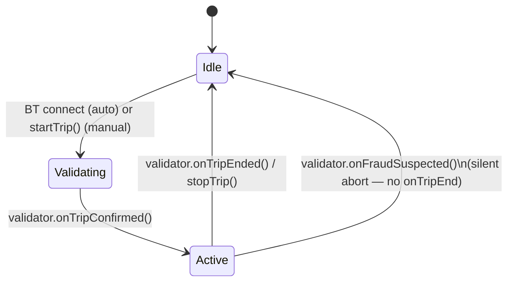

Current behaviour.

# Trip lifecycle

Part of [`driving-sdk`](../README.md) — the trip state machine, pluggable
validation, and per-tick data flow. The README's API Reference section
covers `DrivingSDK`'s public methods and callbacks; this file covers how
they connect.

---

## Pluggable trip validation

Deciding when GPS/BT activity actually counts as a "trip" (vs. noise, a
parked car with the engine running, or a red light) is an app-specific
product decision — the SDK ships a trivial `DefaultTripValidator` that
confirms a trip the moment `start()` is called and never flags anything as
suspicious, so `new DrivingSDK()` works with zero configuration.

To apply your own rules (a minimum-duration/speed gate before confirming a
trip, an idle-timeout to auto-end one, transport-mode fraud detection, …),
implement the `TripValidator` interface and pass an instance via
`SDKConfig.tripValidator`:

```typescript
import type { TripValidator, ValidationSample, SuspiciousActivityEvaluation } from '@/lib/driving-sdk/types';

class MyTripValidator implements TripValidator {
  onTripConfirmed?: () => void;
  onTripEnded?: () => void;
  onFraudSuspected?: (evaluation: SuspiciousActivityEvaluation) => void;

  start(): void { /* begin watching samples */ }
  stop(): void { /* stop watching */ }
  updateSample(sample: ValidationSample): void { /* e.g. accumulate time above a speed threshold */ }
}

const sdk = new DrivingSDK({ tripValidator: new MyTripValidator() });
```

`updateSample()` is called at sensor rate with the latest GPS speed and (when
available) accelerometer/gyroscope readings — and it's called **whether or
not a trip is currently active**, so a validator can watch for the moment a
trip should start, not just judge one already in progress. Call
`onTripConfirmed()` once your rules decide a trip has genuinely started, and
`onTripEnded()` once it's genuinely over — `DrivingSDK` calls `startTrip()` /
`stopTrip()` in response. `onFraudSuspected` is optional and only needed if
your validator also does suspicious-activity detection; when it fires, the
SDK aborts the session **silently** — no `onTripEnd`, so nothing gets
persisted as a completed trip — and calls `onFraudDetected` instead (see
[usage-patterns.md](./usage-patterns.md)). The abort also calls your
validator's `stop()`: the session is over, and a validator left running keeps
judging the last sample it received after the sensors feeding it have stopped.



---

## `InteractionData` per-tick accounting, `(since #138)`

Internal detail — a normal consumer reading `TripData.screenInteractionSeconds` /
`.phoneMotionSeconds` sees no change from this. It matters if you're
reading the SDK's internals or building a similar accumulator pattern
yourself.

Before #138, `PhoneUsageManager`'s `onInteractionData` callback emitted the
full cumulative trip-total snapshot on every call, and `DrivingSDK` simply
overwrote (`=`) `TripData`'s counters with whatever it received. Since #138,
the callback emits a **delta since the previous emission** — exactly once
per second, unconditionally — and `DrivingSDK` **accumulates** (`+=`) those
deltas onto the running totals instead. The externally-visible result is
identical: both `TripData` counters are still running totals for the whole trip.
What changed is where the running-total bookkeeping happens — inside
`PhoneUsageManager` before, inside `DrivingSDK` now — and that the emission is no
longer gated on the driver being distracted (every tick emits, and both deltas are
simply `0` on a tick that counted neither).

---

## Waypoint dilution timing

Covered alongside distance accumulation, since both live in the same
orchestrator code path — see [event-detection.md](./event-detection.md)'s
Distance accumulation section.
