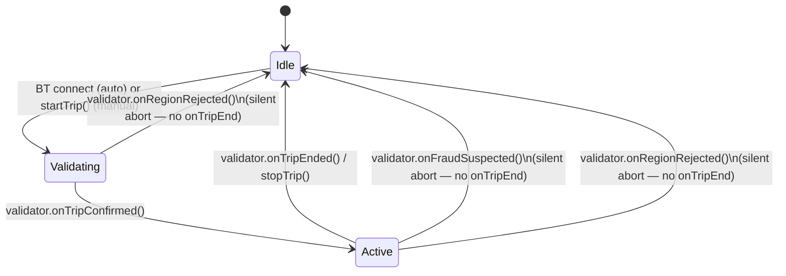

Current behaviour.

# Trip lifecycle

Part of [`driving-sdk`](../README.md) — the trip state machine, pluggable
validation, and per-tick data flow. The README's API Reference section
covers `DrivingSDK`'s public methods and callbacks; this file covers how
they connect.

---

## Pluggable trip validation

Deciding when GPS/BT activity actually counts as a "trip" (vs. noise, a
parked car with the engine running, or a red light) is an app-specific
product decision — the SDK ships a trivial `DefaultTripValidator` that
confirms a trip the moment `start()` is called and never flags anything as
suspicious, so `new DrivingSDK()` works with zero configuration.

To apply your own rules (a minimum-duration/speed gate before confirming a
trip, an idle-timeout to auto-end one, transport-mode fraud detection, …),
implement the `TripValidator` interface and pass an instance via
`SDKConfig.tripValidator`:

```typescript
import type { TripValidator, ValidationSample, SuspiciousActivityEvaluation } from '@/lib/driving-sdk/types';

class MyTripValidator implements TripValidator {
  onTripConfirmed?: () => void;
  onTripEnded?: () => void;
  onFraudSuspected?: (evaluation: SuspiciousActivityEvaluation) => void;
  onRegionRejected?: () => void;

  start(): void { /* begin watching samples */ }
  stop(): void { /* stop watching */ }
  updateSample(sample: ValidationSample): void { /* e.g. accumulate time above a speed threshold */ }
}

const sdk = new DrivingSDK({ tripValidator: new MyTripValidator() });
```

`updateSample()` is called with the latest GPS speed and, when available, the
vehicle-frame IMU values — and it's called **whether or not a trip is
currently active**, so a validator can watch for the moment a trip should
start, not just judge one already in progress.

**Not every call carries a position.** Alongside the calls driven by a GPS
fix, the library also calls `updateSample()` from its 2 s speed-decay tick,
with `speedKmh: 0` and **no `lat`/`lng`** — there is no new position, so
fabricating one from a stale fix is exactly what that path must never do. A
validator that gates on region has to treat a sample without coordinates as
"no information", not as a rejection. The same tick is why a stop is observed
at all on iOS, where the platform delivers no fix while the device is
stationary. See the README's *Speed after a GPS dropout*. Call
`onTripConfirmed()` once your rules decide a trip has genuinely started, and
`onTripEnded()` once it's genuinely over — `DrivingSDK` calls `startTrip()` /
`stopTrip()` in response. `onFraudSuspected` is optional and only needed if
your validator also does suspicious-activity detection; when it fires, the
SDK aborts the session **silently** — no `onTripEnd`, so nothing gets
persisted as a completed trip — and calls `onFraudDetected` instead (see
[usage-patterns.md](./usage-patterns.md)). The abort also calls your
validator's `stop()`: the session is over, and a validator left running keeps
judging the last sample it received after the sensors feeding it have stopped.

`onRegionRejected` is the second silent abort, and behaves identically: a
validator that decides the trip started somewhere it should not be recorded
at all fires it, the SDK tears the session down without `onTripEnd`, and the
host's `onRegionRejected` fires instead. Where the boundary of an acceptable
region lies is the host's decision — the library has no opinion on geography.



---

## `InteractionData` per-tick accounting

Internal detail — a normal consumer reading `TripData.touchEpochs` /
`.screenInteractionSeconds` sees no change from this. It matters if you're
reading the SDK's internals or building a similar accumulator pattern
yourself.

`PhoneUsageManager`'s `onInteractionData` callback emits a **delta since the
previous emission**, exactly once per second and unconditionally, and
`DrivingSDK` **accumulates** (`+=`) those deltas onto the running totals. The
running-total bookkeeping therefore lives in `DrivingSDK`, not in the manager
that produces the samples, and `TripData.touchEpochs` /
`.screenInteractionSeconds` are totals for the whole trip.

The emission is not gated on the phone being hand-held: every tick emits, and
the `screenInteractionSeconds` delta is simply `0` on a tick that was not.

---

## Waypoint dilution timing

Covered alongside distance accumulation, since both live in the same
orchestrator code path — see [event-detection.md](./event-detection.md)'s
Distance accumulation section.
