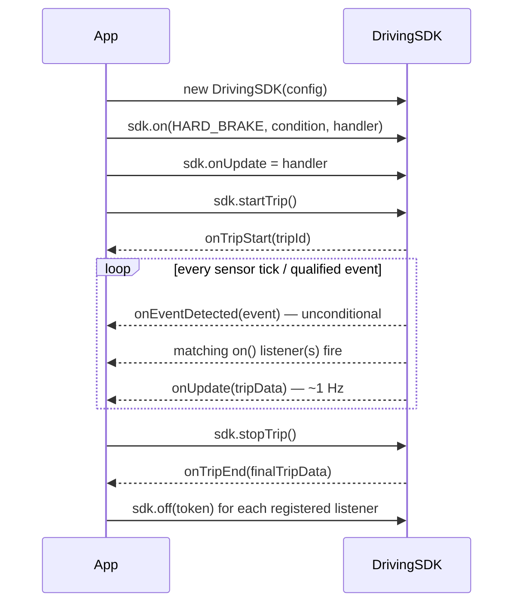

Current behaviour.

# Usage patterns

Part of [`driving-sdk`](../README.md) — copyable integration patterns:
construction, listeners, lifecycle, cleanup. The README covers the API
surface; this file covers how the pieces fit together in a real app.

---

## Constructing the SDK

Instantiate once per app lifecycle — a memoized singleton, not a per-screen
instance. Most consumers never need to set anything beyond the defaults:

```typescript
const sdk = useMemo(() => new DrivingSDK(), []);
```

Pass `tripValidator` only if the default confirm-immediately/never-flag
behavior isn't right for your app — see [trip-lifecycle.md](./trip-lifecycle.md).
Every other `SDKConfig` field (`autoStartOnBluetooth`, `targetBluetoothId`,
`motionThresholds`) has a sensible default; override only the one you
actually need to change.

---

## Listening for events — the full `on()`/`off()` pattern

Any number of listeners may be registered for the same event type with
different conditions or handlers. Each fires independently:

```typescript
// Listener A: immediate warning, any speed
const tokenA = sdk.on(DrivingEventType.HARD_BRAKE, {}, (e) => showWarning(e));

// Listener B: scoring-relevant event, only above driving speed
// (minSeverity is not useful here — HARD_BRAKE carries no severity, CAR-156)
const tokenB = sdk.on(
  DrivingEventType.HARD_BRAKE,
  { minSpeedKmh: 15 },
  (e) => { hardBrakeCount++; },
);

// Cleanup — always pair every on() with an off() when the owning component unmounts
sdk.off(tokenA);
sdk.off(tokenB);
```

A common shape: collect every token from setup into an array, then clean all
of them up together in one place:

```typescript
const listeners = [
  sdk.on(DrivingEventType.HARD_BRAKE, { minSpeedKmh: 15 }, () => { hardBrakes++; }),
  sdk.on(DrivingEventType.AGGRESSIVE_ACCEL, { minSpeedKmh: 15 }, () => { aggressiveAccels++; }),
  sdk.on(DrivingEventType.SHARP_TURN, { minSpeedKmh: 25 }, () => { sharpTurns++; }),
];

// later, in one cleanup step:
listeners.forEach((token) => sdk.off(token));
```

---

## `onUpdate` vs `on()` — when to use which

These answer different questions, and reaching for the wrong one is the most
common integration mistake:

- **`on(type, condition, handler)`** answers *"did a specific, discrete thing
  just happen that met my conditions?"* — a hard brake above 15 km/h, a sharp
  turn above 25. Use it for anything you want to **count as a discrete event**.
- **`onUpdate(data)`** answers *"what does the trip look like right now?"* — a
  1 Hz snapshot of the whole `TripData` object: running distance, duration,
  and the two continuous phone-handling counters (`touchEpochs`,
  `screenInteractionSeconds`). Use it to **mirror ongoing state**, not to
  recompute event counts — those already exist on `TripData.events` if you
  need them, and re-deriving your own counts from `onUpdate` duplicates work
  `on()` already does more precisely.

`PHONE_USAGE` is the clearest example of the distinction. It's tempting to
register `sdk.on(DrivingEventType.PHONE_USAGE, {}, handler)` and count
pickups — but phone handling isn't really a discrete event, it's a continuous
IMU-derived measurement (seconds spent hand-held, glass-tap transients). Most
consumers are better served reading `TripData.touchEpochs` /
`.screenInteractionSeconds` off `onUpdate` than trying to count `PHONE_USAGE`
occurrences.

---

## Bluetooth Events

`BluetoothManager` exposes two system-level connection events, both firing
**only** for the device ID registered via `setTargetDevice()`:

```typescript
const btManager = new BluetoothManager(
  () => console.log('Connected'),
  () => console.log('Disconnected'),
);

btManager.setTargetDevice('AA:BB:CC:DD:EE:FF');
btManager.startMonitoring();
// ...
btManager.stopMonitoring();
```

In practice you rarely touch `BluetoothManager` directly — `DrivingSDK`
already owns one internally and exposes it through `updateTargetDevice()`
(below). Reach for `BluetoothManager` yourself only if you need connection
events completely outside the trip lifecycle.

---

## `updateTargetDevice()` — idempotent re-arm/disarm

Call `updateTargetDevice(id | null)` whenever the target device changes —
the user paired a new one, or disabled the feature. Passing `null` disarms
monitoring entirely:

```typescript
useEffect(() => {
  sdk.updateTargetDevice(driveModeEnabled && pairedDevice ? pairedDevice.id : null);
}, [driveModeEnabled, pairedDevice, sdk]);
```

**Exactly one place in your app should own this call.** It's safe to call
repeatedly with the same value — arming/disarming is idempotent — but if two
different effects both call it based on different state, they race, and
whichever runs last silently wins. Read the device id from wherever it's
actually persisted (not from a value that resets on every render), or the
effect disarms the listener every time it re-runs for an unrelated reason.

---

## `onFraudDetected` handling

By the time this fires, the SDK has **already silently aborted the session** —
no `onTripEnd` call, no partial trip persisted. The handler is for cleanup and
reporting, not for deciding whether to keep the trip:

```typescript
sdk.onFraudDetected = (event) => {
  discardInProgressTripState();
  reportSuspectedFraud(event); // event.detectedMode, event.fraudScore, event.signals, event.telemetry
};
```

---

## Complete integration example

```typescript
import { DrivingSDK, DrivingEventType } from '@/lib/driving-sdk';

// 1. Create the SDK instance
const sdk = new DrivingSDK({ autoStartOnBluetooth: false });

// 2. Trip lifecycle
sdk.onTripStart = (id) => { /* update UI */ };
sdk.onTripEnd   = (data) => { /* persist trip, show summary */ };
sdk.onUpdate    = (data) => { /* update live trip screen */ };

// 3. Register application-specific scoring events — these thresholds are
//    defined BY THE APPLICATION; the SDK knows nothing about what severity
//    or speed constitutes a "scored" event.
const listeners = [
  sdk.on(DrivingEventType.HARD_BRAKE,       { minSpeedKmh: 15 }, () => { hardBrakes++; }),
  sdk.on(DrivingEventType.AGGRESSIVE_ACCEL, { minSpeedKmh: 15 }, () => { aggressiveAccels++; }),
  sdk.on(DrivingEventType.SHARP_TURN,       { minSpeedKmh: 25 }, () => { sharpTurns++; }),
];

// 4. Start and stop
await sdk.startTrip();
// ... user drives ...
const tripData = await sdk.stopTrip();

// 5. Cleanup
listeners.forEach((token) => sdk.off(token));
```

---

## How the callbacks relate to each other


